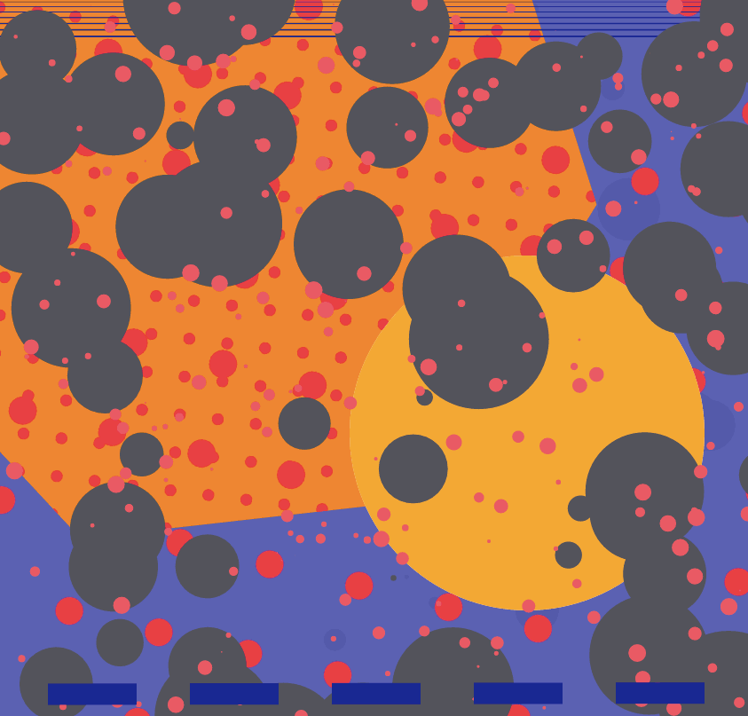

[](https://github.com/Gonzih/feeds2imap.clj/blob/master/LICENSE.md) [](https://travis-ci.org/Gonzih/cljs-electron)

# La Habra: The Shape of Things to DOM

### La Habra is the tool I use to live code visuals as one half of [Codie](https://twitter.com/hi_codie). They look like this.



This repo includes the latest version of the app on master, as well as saved final states from performances in dated branches.

The relevant code is all in `ui_src/ui`. It creates two timers (one for the frame and one to refresh the drawing), provides some timing and drawing shortcut functions, and includes some animation helpers that enable me to do terrible things to the stylesheet from the main Clojurescript file. Also built-in are some basic colors and patterns.

I expect the app to evolve as I perform more, but I don’t promise it will ever be helpful to anyone else.

### La Habra?
I like to say the visuals I make are mostly inspired by sheets I had as a kid. La Habra is where we lived when I got those sheets (and my first Nintendo). It also translates to _there will be_, which I think is the promise of live coding. When we start it isn’t yet, but there will be shapes and music — in a few minutes.

### Live Code?

Live Code events feature algorithmic music and visuals created as the performance runs. Usually an evening of performances is called an algorave.

Check out [Live Code NYC’s twitter account](https://twitter.com/livecodenyc) to find out about the latest algoraves in New York and [Live Coding Research](https://twitter.com/livecodenet) and [Algorave](https://twitter.com/algorave) for more global shenanigans.


### Running it

```shell
npm install electron-prebuilt -g # install electron binaries

lein cooper                      # compile cljs and start figwheel
electron .                       # start electron from another terminal
```

*This project is built on [a cljs/electron app template from Max Gonzih](https://github.com/Gonzih/cljs-electron)*

